 

 

<picture>

  <source media="(prefers-color-scheme: dark)" srcset="https://raw.githubusercontent.com/G-jjunny/G-jjunny/output/github-contribution-grid-snake-dark.svg">

  <source media="(prefers-color-scheme: light)" srcset="https://raw.githubusercontent.com/G-jjunny/G-jjunny/output/github-contribution-grid-snake.svg">

  

</picture>

---

## 📬 Contact

 
